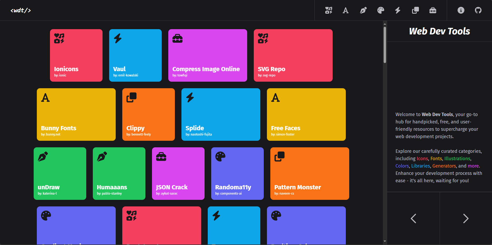

# Web Dev Tools

  

<h4 align="center" style="font-weight: 500">
Developed With
</h4>

  
  
  
  
  

  <a href="#context">Context</a> •
  <a href="#features">Features</a> •
  <a href="#what-i-learned">What I Learned</a>

Web Dev tools is a collection of handpicked, free & easy to use resources that can be helpful for Web developers. Read more about this in the page.

## **Context**

I've always faced the challenge of searching far and wide for web app resources, only to forget their names later. Web Dev Tools is a simple app that compiles some incredibly useful and user-friendly tools I've come across. I've personally tested the majority of the applications listed here, and for the ones I haven't, I've thoroughly researched them and found them to be quite impressive.

## **Features**

### Firebase

- [x] Firestore
- [x] Firebase Storage
- [ ] Firebase auth

### Admin dashboard

- [x] CRUD of Tools
- [x] Form Control Wrapper
- [x] Reactive Forms using FormGroup & FormArray
- [x] AngularFire
- [x] NgRx Store
- [ ] Authentication
- [ ] Roles
- [ ] Interceptors
- [ ] Cache
- [ ] Change from QuerySnapshots to simple fetch
- [ ] Main Dashboard
- [ ] Suggestions Feature

### Main Page

- [x] Dynamic Layout
- [x] Main View
- [x] Categories View
- [x] Animated cards
- [x] Use of SEO tags
- [x] Responsive (still has work to do)
- [x] View Transitions
- [x] Masonry-like grid
- [x] Tool sorter
- [ ] Improve breakpoints
- [ ] Improve card size
- [ ] Use sliding View Transitions

## **What I learned**

- Tailwind is great but it's creating a dependency
- Love DaisyUI but maybe I have to look in other directions
- Redux is hard, and more when used in NgRx
- Astro is so fun and intuitive, looking forward to using it more
- Angular is great for SPAs, sadly it's not that good with SSR or SSG
- Gotta try Standalone componentes
- Gotta optimize more my data flow, avoiding innecesary fetching
- UI design is HAAAAAAAARD, it was the most time consuming thing in the development of this project
- Gotta use UI libraries that will allow me to code faster even tho the design could be more generic
- Gotta define very well my data models from the beginning
- Do I wanna become a firebase expert or should I look other options?
- I wish I knew backend, but it is really time consuming
